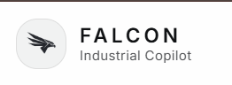

# OCP Industrial Copilot

<p align="center">
  
</p>

<h1 align="center">OCP Industrial Copilot</h1>

<p align="center">
  <b>FALCON — Industrial Copilot</b><br />
  An agentic RAG and 3D Digital Twin system for industrial maintenance.
</p>
Two independently-runnable services, connected over HTTP:

```
ocp-industrial-copilot/
├── frontend/   # TanStack Start app — the "OCP Maroc Industrial Copilot" UI
│               # (3D pump twin, equipment explorer, AI Assistant chat)
└── rag/        # Agentic RAG backend — LangGraph + FastAPI
                 # (POST /chat: analyze → plan scene ops → retrieve →
                 #  grade → generate → validate)
```

They are not code-coupled — `frontend/` talks to `rag/` purely via
`RAG_API_URL` (an HTTP call from the server-side `/api/chat` route,
see `frontend/src/lib/rag-client.server.ts`). Nesting them in one
folder is just for convenience; nothing here assumes a specific
relative path between the two.

## Run both

```bash
# terminal 0 — local LLM (Ollama), once per machine
ollama pull qwen2.5:3b-instruct
ollama serve   # usually already running as a background service after install

# terminal 1 — rag/ backend (port 8000)
cd rag
python -m venv .venv && source .venv/bin/activate
pip install -r requirements.txt
cp .env.example .env
# .env.example already defaults to:
#   LLM_PROVIDER=ollama
#   LLM_MODEL=qwen2.5:3b-instruct
#   OLLAMA_BASE_URL=http://localhost:11434
# no API key needed for this path -- everything runs on-machine.
uvicorn api.main:app --reload

# terminal 2 — frontend (port 3000 by default)
cd frontend
npm i
npm run dev
```

`frontend/.env` already points `RAG_API_URL` at
`http://localhost:8000`. In the app's model picker, select
**"Industrial Knowledge Copilot"** (vendor: Internal) to route chat
through `rag/` instead of the Lovable AI Gateway. The `/twin` page's
"Industrial Assistant" sidebar always talks to `rag/` — it has no
model picker. Both surfaces automatically use whatever `LLM_PROVIDER`
is set in `rag/.env` — no frontend code changes needed to switch
between Ollama and a cloud provider.

### Switching back to a cloud provider

Set in `rag/.env`:
```
LLM_PROVIDER=openai      # or anthropic, or gemini
LLM_MODEL=gpt-4o-mini    # or the model of your choice
LLM_API_KEY=sk-...
```
No code changes required either way — see `rag/config/llm_client.py`.

## Before it returns real answers

`rag/`'s vector store (`rag/data/processed/chroma_db`) needs to be
populated via the ingestion pipeline (`rag/ingestion/pipeline.py` →
`rag/vector_store/indexer.py`) against a `rag/knowledge/` folder tree
first — an empty index means every query falls through to
`insufficient_info`.

## Login / signup returning a 500 error

If email+password signup or Google sign-in returns:
```json
{"code": 500, "error_code": "unexpected_failure", "msg": "Unexpected failure, please check server logs for more information"}
```
This is Supabase Auth's (GoTrue) own generic error shape — it originates
on the Supabase project side, not in this repo's code, so the fix lives
in the **Supabase dashboard**, not in a file here. In order of likelihood:

1. **Google sign-in specifically** → Auth → Providers → Google isn't
   configured (missing/invalid Client ID or Secret), or the redirect
   URL registered in the Google Cloud Console doesn't match Supabase's
   callback URL exactly.
2. **Email+password signup specifically** → Auth → Email isn't
   configured (SMTP settings missing, so the confirmation email can't
   send) — a very common cause of exactly this generic error.
3. **Both paths** → check Supabase Dashboard → Logs → Auth Logs for the
   actual underlying error; `unexpected_failure` is GoTrue's catch-all
   and the real cause is only visible there, not in this generic
   message.

This repo's own `handle_new_user()` trigger (auto-creates a `profiles`
row on signup) has been hardened in
`supabase/migrations/20260912000000_harden_handle_new_user.sql` so a
failure there can no longer be the cause of a signup 500 — but that
migration won't fix a provider/SMTP configuration issue, which is the
more likely root cause. Apply it with `supabase db push` (or via the
dashboard's SQL editor) if you use the Supabase CLI to manage
migrations.

## AI-driven scene control (digital twin)

The agent can also drive the 3D viewer, not just answer questions —
"explode the seal area and mark the bearing as critical" both answers
and mutates the scene. The path:

```
User message
  → rag/agentic/nodes/plan_scene_ops.py    (LLM: decide if a scene change is needed, and what ops)
  → rag/agentic/nodes/execute_scene_ops.py (deterministic: validate + call MCP tools)
  → rag/mcp_server/scene_tools_server.py   (MCP server: focus_component, set_view_mode,
                                             set_component_state, get_scene_state)
  → ChatResponse.scene_ops                 (applied ops, sent back to the frontend)
  → frontend/src/lib/rag-client.server.ts  (maps RAG component ids -> pump-data.ts ids,
                                             encodes an invisible marker in the streamed text)
  → AIAssistant.tsx                        (strips the marker, calls onSceneOps)
  → Viewer3D.tsx                           (applies via its `sceneCommand` prop)
```

Most questions ("explain cavitation") produce zero ops — this only
fires when the message clearly implies a visual/scene change. Known
scope limits of this narrow first slice:
- Only 3 ops exist: focus, view-mode (normal/exploded/section), and
  component health state. No geometry generation, no multi-asset
  scenes.
- `mcp_server/client.py` spawns a fresh subprocess per tool call
  (documented there) — fine for the current call volume, not for a
  hot path.
- The `bearings` component id is ambiguous in the RAG's vocabulary
  (doesn't distinguish drive-end/non-drive-end) and defaults to
  drive-end on the frontend side (`rag-client.server.ts`).
- The MCP server's own in-memory scene state is a debugging aid only
  and is never read by the frontend — see that module's docstring.

## Deploying separately later

If/when this stops being local-dev-only, the two services can be
deployed independently (e.g. `rag/` as a container behind its own
URL) — just point `RAG_API_URL` in the frontend's environment at
wherever `rag/`'s FastAPI app ends up. No frontend code changes
needed for that move.

